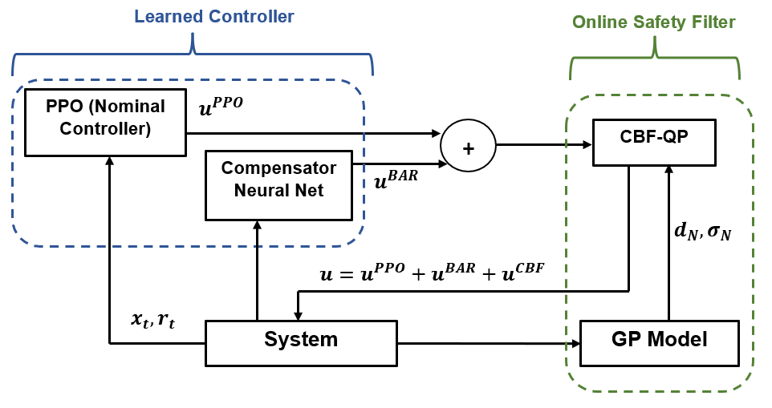
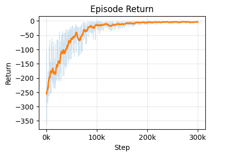
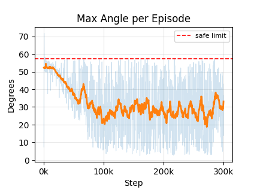
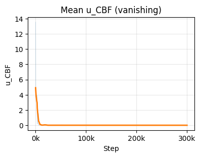
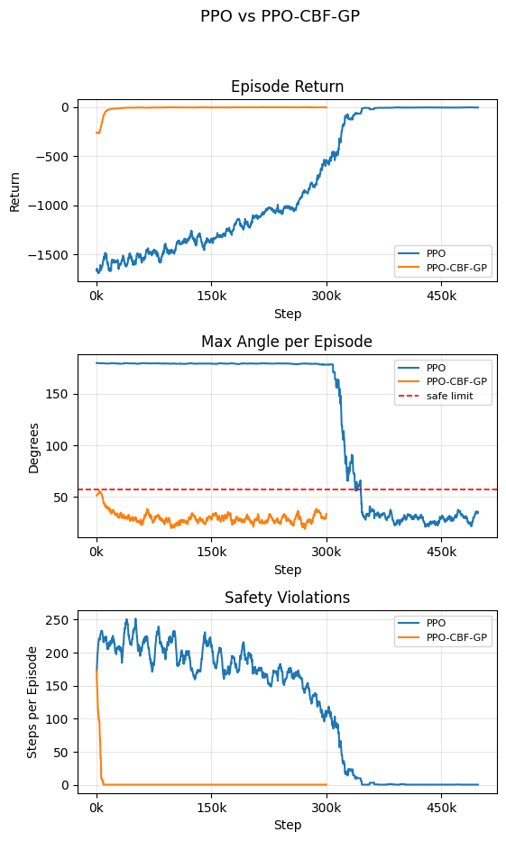

# Safe Deep Reinforcement Learning via Control Barrier Functions

This repository implements a PPO-CBF-GP controller for safe inverted pendulum
control. It combines a PPO policy, a Control Barrier Function (CBF) safety
filter, a neural compensator, and Gaussian Process (GP) residual dynamics
learning.

## Framework

<p align="center">
  
</p>

The diagram summarizes the control loop. PPO proposes the nominal action, the
compensator network learns from previous barrier corrections, and the CBF-QP
applies the final safety correction before the action reaches the system. The GP
model learns residual dynamics from rollouts and provides the safety filter with
a model correction and an uncertainty estimate.

## Results

The figures below are generated from the included training and comparison logs.

<p align="center">
  
  
  
</p>

<p align="center">
  
</p>

The PPO-CBF-GP training and simulation results use a mismatched nominal model,
so the GP residual model has to correct the dynamics during learning.

The comparison files in `results/comparison_ppo_ppo-cbf-gp/` use a separate
setup with known dynamics. In that experiment, the nominal model used by
PPO-CBF-GP matches the simulator dynamics so the comparison isolates the effect
of the CBF safety filter against a standard PPO baseline trained without any
safety filter.

## Mathematical Framework

The nominal pendulum model is written as a discrete-time control-affine system
with unknown residual dynamics:

$$
x_{t+1} = f_{\mathrm{nom}}(x_t) + g_{\mathrm{nom}}u_t + d(x_t).
$$

The safety constraints are enforced through four affine barrier functions,

$$
h_i(x)=F-H_i x,\qquad i=1,\dots,4,
$$

where the rows $H_i$ define the pendulum angle-velocity envelope:

$$
H_1=[1\ \lambda],\quad
H_2=[1\ -\lambda],\quad
H_3=[-1\ \lambda],\quad
H_4=[-1\ -\lambda].
$$

The CBF condition is imposed for each barrier constraint to preserve the safe
set:

$$
h_i(x_{t+1}) \ge (1-\gamma_b)h_i(x_t), \qquad \gamma_b \in (0,1].
$$

The GP learns the one-step residual between the real transition and the nominal
predictor:

$$
\tilde d_t = x_{t+1} - \left(f_{\mathrm{nom}}(x_t)+g_{\mathrm{nom}}u_t\right),
$$

and provides a mean correction and uncertainty estimate
$\hat d_N(x_t)$ and $\hat\sigma_N(x_t)$ for the safety filter.

At training iteration $k$, PPO and the compensator form the augmented nominal
input

$$
u_k^{\mathrm{aug}}(x)
= u_k^{\mathrm{PPO}}(x)+u_k^{\mathrm{BAR}}(x),
$$

and the GP-CBF safety filter solves the residual correction QP:

```math
\begin{aligned}
(u_k^{\mathrm{CBF}},\varepsilon_k)
&=
\arg\min_{v,\varepsilon}
\frac{1}{2}\|v\|^2 + K_\varepsilon \varepsilon \\
\text{s.t.}\quad
&F-H_i\!\left(
f_{\mathrm{nom}}(x_t)
+g_{\mathrm{nom}}\left(u_k^{\mathrm{aug}}(x_t)+v\right)
+\hat d_N(x_t)
\right) \\
&\quad
-k_\delta |H_i|\hat\sigma_N(x_t)
-(1-\gamma_b)(F-H_i x_t)
\ge -\varepsilon,
\qquad i=1,\dots,4,\\
&u_{\min}\le u_k^{\mathrm{aug}}(x_t)+v\le u_{\max},\\
&\varepsilon \ge 0.
\end{aligned}
```

The deployed control is therefore

$$
u_k(x_t)
= u_k^{\mathrm{PPO}}(x_t)
+ u_k^{\mathrm{BAR}}(x_t)
+ u_k^{\mathrm{CBF}}(x_t).
$$

If the QP is feasible with zero relaxation, the original safe set is forward
invariant with probability $1-\delta$. The compensator is trained to absorb past
CBF corrections, so the residual online correction decreases as training
converges.

## Repository Structure

```text
code/
  ppo_cbf_gp_train.py        PPO-CBF-GP training script
  ppo_cbf_gp_simulation.py   Simulation script for a trained controller
  comparison_rl.py           PPO vs PPO-CBF-GP comparison plot
  src/                       Agent, environment, CBF, GP, args, and plotting helpers
  notebooks/                 Standalone reference notebooks
assets/                      README figures
results/                     Saved models, logs, figures, and videos
```

## Installation

Create and activate a Python virtual environment, then install the runtime
dependencies:

```bash
python -m pip install -r requirements.txt
```

For development tools:

```bash
python -m pip install -r requirements-dev.txt
```

Video export requires FFmpeg.

```powershell
winget install Gyan.FFmpeg
ffmpeg -version
```

## Quickstart

Run a short training smoke test:

```bash
python code/ppo_cbf_gp_train.py --total-timesteps 300 --num-steps 300 --update-epochs 1 --bar-train-steps 1 --save-model False
```

Run simulation with the included trained model:

```bash
python code/ppo_cbf_gp_simulation.py
```

Generate the PPO vs PPO-CBF-GP comparison figure:

```bash
python code/comparison_rl.py
```

## Training From Scratch

Run training with the default settings:

```bash
python code/ppo_cbf_gp_train.py
```

Override hyperparameters from `code/src/args.py` using command-line flags:

```bash
python code/ppo_cbf_gp_train.py --total-timesteps 300000 --num-steps 3000 --seed 1
```

Show all training options:

```bash
python code/ppo_cbf_gp_train.py --help
```

## Pretrained Model

The included PPO-CBF-GP checkpoint comes from the mismatched dynamics
experiment:

```text
results/trained_models/inverted_pendulum.pt
results/trained_models/inverted_pendulum_gp.joblib
```

Use these files with `code/ppo_cbf_gp_simulation.py` to reproduce the included
pendulum simulation video.

The checkpoints inside `results/comparison_ppo_ppo-cbf-gp/` are kept separately
because they belong to the PPO vs PPO-CBF-GP comparison experiment.

## Notebooks

The notebooks are reference copies of the original experiments:

- `code/notebooks/PPO_CBF_GP_InvertedPendulum_train_standalone.ipynb`
- `code/notebooks/PPO_InvertedPendulum_train_standalone.ipynb`

## Development

Format and lint the Python code with:

```bash
python -m ruff check code --fix
python -m black code
python -m ruff check code
python -m black --check code
```

Install Git hooks once:

```bash
python -m pre_commit install
```

Run the hooks manually:

```bash
python -m pre_commit run --all-files
```

## References

- Cheng et al. repository: [rcheng805/RL-CBF](https://github.com/rcheng805/RL-CBF)
- CleanRL repository: [vwxyzjn/cleanrl](https://github.com/vwxyzjn/cleanrl)
